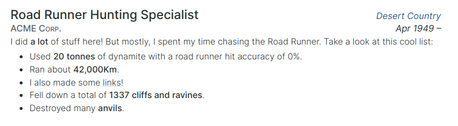

<h1 align="center">cvgen</h1>

<p align="center">Create your CV using only Markdown + (S)CSS</p>


## Idea

I was tired of updating my LaTeX CV for every job posting I wanted to send it.
Even though LaTeX is great, it is more suited for academic writing. Creating
complicated templates for something like this is tiring.

Nowadays, web technologies are much more suited for this task. HTML + CSS are
very easy to use and extremely powerful for designing.

This project aims to make everything even easier by using
[GatsbyJS](https://www.gatsbyjs.com/) to render a beautiful CV and Cover Letter
with different sections using data defined in Markdown and style them with SCSS.

As a quick example, using the default style, this code:

```markdown
---
title: Road Runner Hunting Specialist
subtitle: ACME Corp.
location: Desert Country
startDate: 1949-04-04
endDate:
---

I did **a lot** of stuff here! But mostly, I spent my time chasing the
Road Runner. Take a look at this cool list:

* Used **20 tonnes** of dynamite with a road runner hit accuracy of 0%.
* Ran about **42,000Km**.
* I also made some [links](https://example.com)!
* Fell down a total of **1337 cliffs and ravines**.
* Destroyed many **anvils**.
```

Will look like this:



You can check out the results in [my CV](https://cvgen.meneillos.com).


## 🚀 Using it yourself

The final uses of this application are one or more of the following:

1. Set up a **local dev instance** where you can watch edit your CV and see the
   changes in real time as you go.
2. **Export a PDF version** of your CV.
3. **Host** your CV.

### Local dev instance

To start a local dev server, you only need to install GatsbyJS and run it:

```bash
sudo npm i -g gatsby
npm i
gatsby develop
```

You will be able to see a live version of the CV that updates as you edit it by
pointing your browser to http://localhost:8000.


### Print a PDF version

You can do this from the browser by using the "Print to PDF" destination in the
Print dialog.

Another option is to run (only on Linux for now):

```bash
sudo npm i -g gatsby
npm i
npm run print
```


### Host your CV

You can build a version to serve online with:

```bash
sudo npm i -g gatsby
npm i
gatsby build
```

Keep in mind, if you want to host it somewhere not in the domain root, you will
have to edit the `pathPrefix` variable of
[`./gatsby-config.js`](gatsby-config.js) with the path.


## Structure

You only need to create markdown files in the [`./src/content`](src/content/)
directory, which will get picked up by the compiler.

The different sections are:

```
cvgen
├── Cover Letter
│   ├── header.md               <- Header, shared between Cover Letter and CV
│   └── cover-letter.md         <- Cover Letter body
└── CV
    ├── header.md               <- Header, shared between Cover Letter and CV
    ├── profile.md              <- Personal profile short text
    ├── experience.*.md         <- Job experience, one job per file
    ├── education.*.md          <- Degrees and courses, one per file
    ├── languages.md            <- Spoken languages list
    ├── skills-tech.md          <- Technical skills list
    ├── skills-pers.md          <- Soft skills list
    ├── publications.md         <- Publications and talks
    ├── extracurricular.*.md    <- Extracurricular activities, one per file
    ├── training.md             <- Training
    └── interests.md            <- Hobbies and personal interests
```

You can reorder this sections by editing the components inside `<Page>` in the
file [`./src/pages/index.js`](src/pages/index.js).


## Style

Styling is done by editing the SCSS files at `.src/styles`. You are on your own
on this (for now).


## To-do

* Add different styles.
